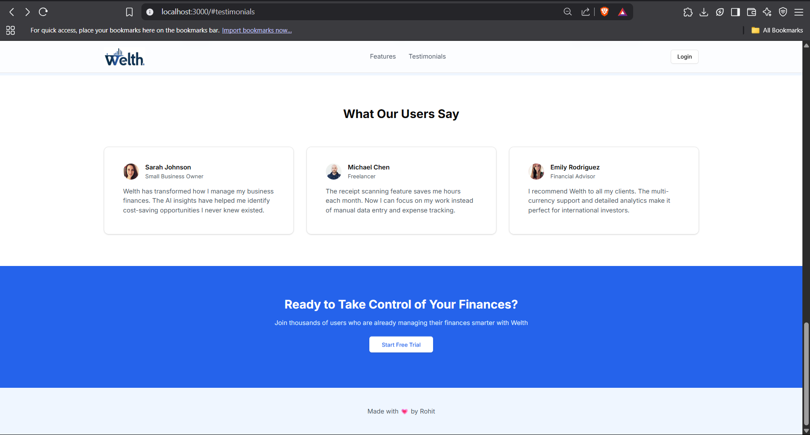
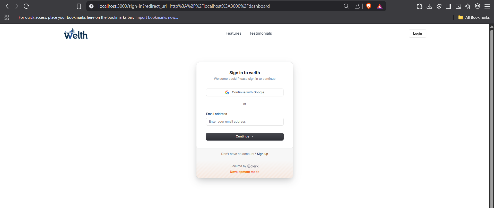
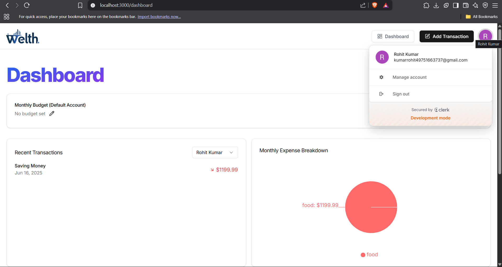
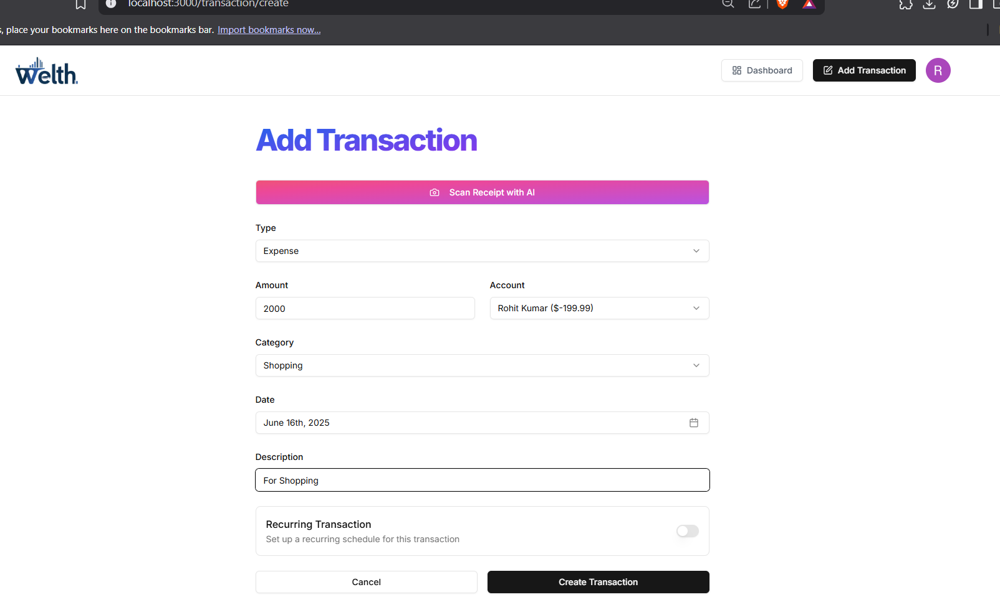
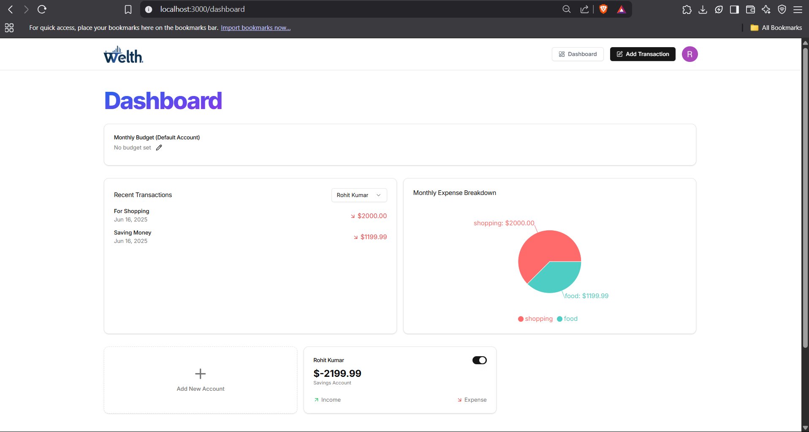

💸 AI Finance Platform

An advanced full-stack AI-powered personal finance tracking application built using modern web technologies. The platform allows users to manage their transactions, view summaries, and receive smart financial suggestions through AI integration.

🚀 Live Demo

🔗 [View Deployed Project](https://ai-finance-platform-ea2j-n055fw7cf.vercel.app)

## 📸 Screenshots

### 1. Dashboard

### 2. AI Suggestions

### 3. Add Transaction

### 4. Auth Page

### 5. Onboarding

🛠 Tech Stack Used

Frontend:

Next.js 15 (App Router) – React framework for building modern web apps

Tailwind CSS – Utility-first styling

ShadCN UI – Beautiful accessible components

Clerk Auth – Authentication & user management

Backend:

PostgreSQL – Relational database hosted on Railway

Prisma ORM – Type-safe DB access and migrations

Resend – Email sending service

Gemini API (Google) – AI-based recommendation system

Inngest – Serverless background tasks

Arcjet – Bot protection and rate-limiting

📦 Features

✅ User sign-up/sign-in with Clerk
✅ Add, edit, and delete income & expense transactions
✅ Smart financial insights powered by AI (Gemini API)
✅ PostgreSQL database with Prisma schema
✅ Protected routes and onboarding flow
✅ Background task support with Inngest
✅ Bot detection and performance security with ArcJet
✅ Email integration with Resend API

🧠 How It Works

1. User Authentication: Users sign up/sign in with Clerk.

2. Dashboard: Displays transaction summary, balance, and analytics.

3. AI Suggestions: Gemini AI analyzes spending patterns and suggests improvements.

4. Database: Transactions are stored securely in PostgreSQL using Prisma ORM.

5. Security & Background Jobs: Arcjet protects routes, and Inngest handles async workflows.

📁 Folder Structure (Simplified)

app/
├─ api/            # API routes
├─ dashboard/      # Authenticated dashboard pages
├─ onboarding/     # After-signup user onboarding
├─ sign-in/        # Clerk sign-in page
├─ sign-up/        # Clerk sign-up page
lib/               # Database and utility functions
prisma/            # Prisma schema and migrations
public/            # Static files and screenshot
.env               # Environment variables

🧪 Getting Started Locally

git clone https://github.com/rohits78/ai-finance-platform.git
cd ai-finance-platform
npm install
npx prisma db push
npm run dev

📬 Contact
Rohit Kumar
📧 kumarrohit49751663737@gmail.com

Made with 💙 by Rohit using AI, code, and caffeine ☕
